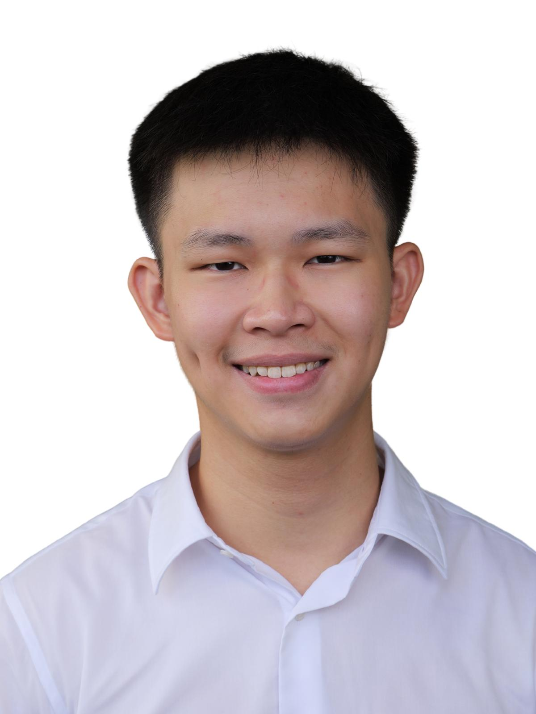
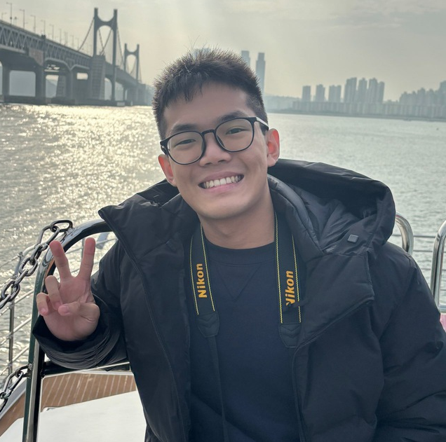

# About Us

We are a team based in the [School of Computing, National University of Singapore](http://www.comp.nus.edu.sg).

You can reach us at the email `e1398129@u.nus.edu`

## Project team

### Viswanathan Jasmitha

[[homepage](https://ay2526s2-cs2103t-f10-4.github.io/tp)]
[[github](https://github.com/jasmitha-05)]
[[portfolio](team/jasmitha.md)]

* Role: Project Advisor

### Elliot Tan

[[github](http://github.com/ELLIOTANBZ)]
[[portfolio](team/elliotanbz.md)]

* Role: Team Lead
* Responsibilities: UI

### Enzo Chung

[[github](http://github.com/enzochung)]
[[portfolio](team/enzochung.md)]

* Role: Developer
* Responsibilities: Data

### Kai Jun

[[github](https://github.com/KyiCode)]
[[portfolio](team/kyicode.md)]

* Role: Developer
* Responsibilities: Dev Ops + Threading

### James Doe

[[github](http://github.com/johndoe)]
[[portfolio](team/johndoe.md)]

* Role: Developer
* Responsibilities: UI
